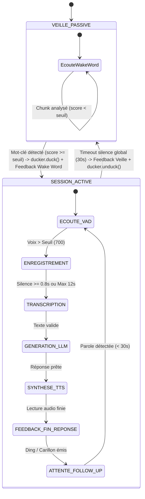

# 🤖 Guide d'Architecture & Directives pour Agents — SmartHome

Ce document est destiné aux agents IA (et aux développeurs) qui lisent, maintiennent, optimisent ou étendent le code du projet **SmartHome**.

---

## 🎯 1. Vision & Philosophie du Projet

**SmartHome** est un assistant vocal domotique conçu avec les principes suivants :
1. **100% Local & Souverain** : Aucune donnée audio ou textuelle ne doit transiter par des serveurs tiers ou le cloud.
2. **Faible Latence (Temps Réel)** : Le pipeline audio de bout en bout (Détection -> STT -> LLM -> TTS) est optimisé pour une réponse rapide et naturelle.
3. **Modularité Découplée** : Chaque étape du pipeline réside dans un module autonome, testable individuellement via son propre point d'entrée CLI.
4. **Continuité Conversationnelle** : Gestion d'une session de dialogue active (follow-up) pour éviter d'imposer à l'utilisateur de répéter le mot-clé à chaque échange.

---

## 📐 2. Cartographie Technique des Composants

```
┌─────────────────────────────────────────────────────────────────────────────────────────────────────────┐
│                                                 main.py                                                 │
│                                    (Orchestrateur & Machine à États)                                    │
└────────┬───────────────────┬───────────────────┬───────────────────┬───────────────────┬────────────────┘
         │                   │                   │                   │                   │
         ▼                   ▼                   ▼                   ▼                   ▼                   ▼
┌─────────────────┐ ┌─────────────────┐ ┌─────────────────┐ ┌─────────────────┐ ┌─────────────────┐ ┌─────────────────┐
│   wakeword.py   │ │  transcribe.py  │ │     llm.py      │ │     tts.py      │ │   feedback.py   │ │   ducking.py    │
│  (openWakeWord) │ │ (faster-whisper)│ │ (Ollama Client) │ │   (Piper TTS)   │ │ (Sons & Signaux)│ │(PipeWire/Pulse) │
└────────┬────────┘ └────────┬────────┘ └────────┬────────┘ └────────┬────────┘ └────────┬────────┘ └────────┬────────┘
         │                   │                   │                   │                   │                   │
         └───────────────────┴───────────────────┴─────────┬─────────┴───────────────────┴───────────────────┘
                                                           ▼
                                           ┌───────────────────────────────┐
                                           │           config.py           │
                                           │   (Chargeur .env & Typage)    │
                                           └───────────────────────────────┘
```


### 2.1 [main.py](file:///home/suissard/PROGRAMMATIONS/SmartHome/main.py) — Orchestrateur Principal
- **Responsabilité** : Initialise le flux d'entrée micro partagé (`PyAudio`), gère la boucle d'événements, le ducking sonore et maintient l'état conversationnel.
- **Paramètres Clés** :
  - `FOLLOW_UP_TIMEOUT = 30.0` : Durée (en secondes) pendant laquelle l'assistant reste en écoute active après une réponse.
- **Cycle de Fonctionnement** :
  1. Écoute passive par paquets (`CHUNK = 1280` à `RATE = 16000`).
  2. Si le mot-clé est validé (`score > threshold`), atténuation audio globale via `ducker.duck()`, notification `feedback.on_wakeword_detected()`, puis passage en mode `in_conversation = True`.
  3. Boucle de follow-up : appel de `transcriber.record_and_transcribe(...)`.
  4. Si du texte est reçu : inférence LLM (`ask_llm`), vocalisation (`tts.speak`), puis signal sonore de fin de tour `feedback.on_response_end()`.
  5. Si timeout de silence : notification de mise en veille `feedback.on_timeout()`, purge du flux, restauration du son système via `ducker.unduck()`, et retour en veille passive.

### 2.2 [wakeword.py](file:///home/suissard/PROGRAMMATIONS/SmartHome/wakeword.py) — Détection de Mot-Clé
- **Technologie** : `openwakeword` avec moteur d'inférence ONNX Runtime.
- **Format Audio requis** : `RATE = 16000` Hz, 1 canal (mono), `FORMAT = paInt16`, `CHUNK = 1280` échantillons (80 ms par trame).
- **Fonctionnement** :
  - `process_chunk(audio_chunk)` injecte la trame dans le buffer prédictif d'OpenWakeWord.
  - Si le score dépasse `threshold` (par défaut `0.5`), le buffer interne est purgé via `self.oww.reset()` pour éviter les détections fantômes consécutives.

### 2.3 [transcribe.py](file:///home/suissard/PROGRAMMATIONS/SmartHome/transcribe.py) — Enregistrement & STT
- **Technologie** : `faster-whisper` (modèle `base`, quantifié en `int8` sur CPU).
- **Gestion VAD & Audio** :
  - `pre_buffer` (`deque(maxlen=4)`) : Conserve les 4 dernières trames (320 ms) pour ne jamais couper l'attaque de la voix.
  - `voice_threshold = 700` : Détection du début de parole par calcul de la moyenne absolue des amplitudes (`np.abs(chunk).mean()`).
  - `silence_duration = 0.8s` : Seuil de silence consécutif marquant la fin naturelle d'une phrase.
  - `_flush_stream()` : Purge le buffer résiduel de la carte son avant chaque écoute pour éliminer les bruits résiduels ou l'écho de la synthèse précédente.
- **Conversion** : Assemblage des trames dans un buffer WAV en mémoire (`io.BytesIO`) avant passage dans Whisper.

### 2.4 [llm.py](file:///home/suissard/PROGRAMMATIONS/SmartHome/llm.py) — Raisonnement & Génération
- **Technologie** : API locale `ollama` (`qwen2.5:7b` par défaut).
- **Prompt Système** :
  > *"Tu es un assistant vocal domotique. Réponds en français de manière claire, concise et directe (1 à 2 phrases max). N'utilise pas de markdown complexe."*
- **Streaming** : Supporte le streaming console immédiat pour un retour visuel en temps réel pendant la génération.

### 2.5 [tts.py](file:///home/suissard/PROGRAMMATIONS/SmartHome/tts.py) — Synthèse Vocale
- **Technologie** : `piper-tts` avec modèle neural ONNX (`voice.onnx` + `voice.onnx.json`).
- **Post-Traitement Audio Anti-Pops & Fluidité** :
  1. *Ponctuation forcée* : Ajout automatique d'un point final si manquant pour garantir une intonation descendante naturelle.
  2. *Fade-Out (50 ms)* : Atténuation linéaire en fin de signal pour supprimer les clics numériques de fin de flux.
  3. *Padding de silence* : Insertion de 100 ms de silence en début de buffer et 400 ms en fin de buffer.
  4. *Lecture synchrone* : Exécution via `sounddevice` (`sd.play` + `sd.wait`).

### 2.6 [feedback.py](file:///home/suissard/PROGRAMMATIONS/SmartHome/feedback.py) — Sons & Signaux Vocaux de Cycle de Vie
- **Technologie** : Synthèse harmonique procédurale (`numpy` + `sounddevice`) & lecteur WAV.
- **Rôle** : Gère les retours sonores (bips, carillons, accords ascendants/descendants, ding) et vocaux (phrases TTS) pour la détection du wake word, la fin de parole de l'IA et le timeout d'écoute active.

### 2.7 [ducking.py](file:///home/suissard/PROGRAMMATIONS/SmartHome/ducking.py) — Atténuation Audio Système (Ducking)
- **Technologie** : `pactl` JSON (compatible PipeWire & PulseAudio).
- **Rôle** : Réduit le volume de toutes les applications tierces (musique, vidéos, jeux, etc.) à un niveau paramétrable (ex: 20%) dès que l'assistant écoute ou parle, et rétablit les volumes initiaux à la mise en veille. Filtre le PID de l'assistant pour ne pas altérer la voix de sortie.

### 2.8 [config.py](file:///home/suissard/PROGRAMMATIONS/SmartHome/config.py) — Chargeur de Configuration & Variables d'Environnement
- **Technologie** : `python-dotenv`.
- **Rôle** : Charge `.env` avec conversion de types stricte (`int`, `float`, `bool`, `str`, `Optional`) et fallbacks par défaut pour toutes les constantes du projet (audio, wake word, whisper, ollama, piper, feedbacks, ducking).

---

## 🔄 3. Diagramme de la Machine à États



---

## 🛠️ 4. Directives de Développement & Règles pour les Agents

Lors de toute intervention sur ce codebase, veillez à respecter les règles suivantes :

### 1. Préservation des Points d'Entrée de Test Autonomes
Chaque module Python (`config.py`, `wakeword.py`, `transcribe.py`, `llm.py`, `tts.py`, `feedback.py`, `ducking.py`, `test_sound.py`) **doit impérativement conserver son bloc `if __name__ == "__main__":`**. Ces blocs permettent un diagnostic isolé sans charger toute la pile applicative.


### 2. Gestion des Flux Audio & Synchronisation
- **Attention au Microphone Lock** : L'objet `stream` (`pyaudio.Stream`) est partagé entre la détection de wake word et le transcripteur. Veillez à ne pas ouvrir plusieurs flux concurrents sur le même device audio sous Linux (risque de conflit ALSA/PulseAudio).
- **Purge de Buffer** : Toujours appeler `_flush_stream()` après une synthèse vocale ou avant un nouvel enregistrement pour éviter de réinjecter l'écho du TTS dans le STT.

### 3. Gestion des Modèles & Formats
- Les modèles de mot-clé doivent être placés dans le dossier `wakewords/` et chargés sous forme de fichiers ONNX compatibles avec OpenWakeWord.
- Pour Whisper, privilégiez `device="cpu"` et `compute_type="int8"` pour garantir une compatibilité universelle sur tout CPU moderne sans surcharger la mémoire vidéo du LLM.

### 4. Centralisation des Variables & Configuration
- **Aucune variable de paramétrage ne doit être écrite en dur** directement dans les fonctions ou classes.
- Déclarez toujours les nouvelles variables dans `.env.example`, `.env` et exposez-les via `config.py` avec une valeur de repli (*default fallback*).


---

## 🚀 5. Roadmap Technique & Perspectives d'Évolution

Pour les futures évolutions du projet, les axes prioritaires sont :

1. **Intégration Domotique (Home Assistant)** :
   - Implémentation du *Function Calling / Tool Use* dans `llm.py` pour router des intentions vers Home Assistant (API REST / WebSocket).
2. **Streaming Pipeline (Audio en flux tendu)** :
   - Découper la sortie LLM par phrases/propositions et démarrer la synthèse TTS Piper dès les premiers mots sans attendre la fin complète de la génération.
3. **Barge-in / Annulation d'Écho Acoustique (AEC)** :
   - Permettre à l'utilisateur d'interrompre l'assistant pendant qu'il parle sans créer de larsen audio.
4. **Multi-room / MQTT Audio Satellite** :
   - Déporter la capture audio vers des satellites ESP32 / Raspberry Pi via protocole léger (ex: Wyoming / MQTT).
